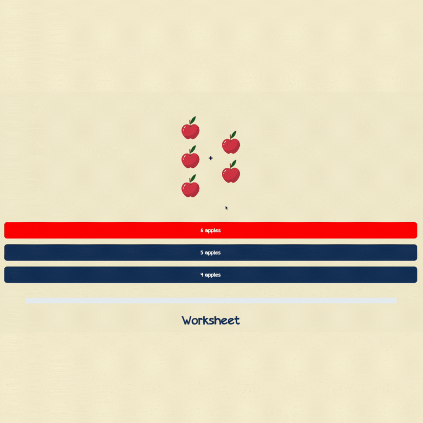

# StudyHelp


An educational mobile app built with Expo + React Native that helps kids practice early math with an engaging, space‑themed flow. It uses Expo Router for navigation, custom fonts, vector icons, and a short intro video that leads into an interactive worksheet.

## Demo




## Features

- Home dashboard: progress bar, selectable levels, and coloring sheet previews.
- Math tab: space scene with a rocket button that launches an intro video.
- Auto‑advance: upon video completion, navigates to a math worksheet.
- Worksheet: apple‑count addition with multiple‑choice answers and progress tracking.
- Tabs for Literature, Science, and Settings (currently placeholders for expansion).

## Tech Stack

- React Native (Expo SDK 52)
- Expo Router for file‑based navigation
- `expo-av` for video playback
- `expo-font` for custom font loading (Education-Pencil)
- `react-native-ui-lib` ProgressBar
- `react-native-svg` for simple line/path graphics
- TypeScript

## Getting Started

### Prerequisites

- Node.js 18+ (required by Expo SDK 52)
- Git (optional)
- iOS: Xcode + Simulator, Android: Android Studio + Emulator, or Expo Go on a device

### Install

```bash
npm install
```

### Run

Start the Expo dev server:

```bash
npm run start
```

Then:

- Press `i` to launch iOS Simulator
- Press `a` to launch Android Emulator
- Or scan the QR code with Expo Go

### Useful Scripts

- `npm run ios` – start and open iOS
- `npm run android` – start and open Android
- `npm run web` – start in a web browser (limited feature parity)
- `npm test` – run tests with `jest-expo`
- `npm run lint` – run Expo/ESLint checks

## App Structure

File‑based routes (Expo Router) live under `app/`:

- `app/_layout.tsx` – root stack: tabs, `math-video`, `math-worksheet`
- `app/(tabs)/_layout.tsx` – bottom tabs (Math, Home, Literature, Science, Settings)
- `app/(tabs)/index.tsx` – Home: progress, levels, coloring sheets
- `app/(tabs)/math.tsx` – Math scene with rocket → navigates to video
- `app/math-video.tsx` – Plays intro video, then routes to worksheet
- `app/math-worksheet.tsx` – Apple addition multiple‑choice + progress bar
- `app/components/LevelButton.tsx` – Reusable circular level button
- `app/+not-found.tsx` – Fallback route

Assets are under `assets/`:

- `assets/images/` – icons, backgrounds, sprites
- `assets/videos/` – `math-intro.mp4`
- `assets/fonts/` – `Education-Pencil.ttf` (loaded via `useFonts`)

## How It Works

1. Open the Math tab and tap the rocket.
2. A short intro video starts and enters fullscreen.
3. When the video finishes, you’re taken to the worksheet.
4. Select the correct sum (apple‑count). Correct answers advance to the next question; incorrect answers disable the chosen option so you can try again.
5. The progress bar fills across questions. Returning to Home shows a separate progress display and level selector (visual only in current build).

## Configuration Notes

- App name, icons, and splash are configured in `app.json`.
- Custom font: make sure `assets/fonts/Education-Pencil.ttf` remains at the declared path.
- No environment variables are required for the current feature set.

## Testing & Linting

- Tests: `npm test` (Jest via `jest-expo`)
- Lint: `npm run lint`

## Roadmap Ideas

- Persist progress and selected level across sessions.
- Expand Literature and Science tabs with similar learning flows.


